<!-- Welcome to your 100+ Years Future Cybernetic Profile README! -->

  <!-- Holographic UI Centerpiece Banner -->
  
  
    

  <!-- Animated Cybernetic Typing Diagnostics -->
  

  <!-- Cybernetic Badges & Metrics -->
  

    
    &nbsp;
    
    &nbsp;
    
  

  

---

### 📡 System Manifest: Cognitive Summary
> `[COGNITIVE INDEX: abhigyan-neural-core-v1.0]`
> 
> AI Student and Full-Stack Developer specializing in training advanced machine learning models and crafting responsive, high-performance web systems. Merging neural cognitive algorithms with cutting-edge client-server architectures.

- 🌌 **Current Core Objective:** Designing deep neural model layers and architecting distributed full-stack system topologies.
- 🧬 **Cognitive Uplinks:** Artificial intelligence, machine learning pipelines, micro-frontend modules, and low-latency APIs.
- ⏳ **Chronological Constant:** Performance optimization, model alignment, and state-of-the-art designs.

---

### 🛡️ Cybernetic Modules (Augmented Tooling)

| Cognitive Sector | System Protocols & Subsystems |
| :--- | :--- |
| **Holographic Frontend** |       |
| **Logic & Quantum DBs** |      |
| **Orbital Deployment** |     |

---

### 📊 Quantum Telemetry (GitHub Core Metrics)

  <table border="0" style="border: none;">
    <tr style="border: none;">
      <td width="50%" align="center" style="border: none;">
        <!-- Neon Cyber Stats Card -->
        
      </td>
      <td width="50%" align="center" style="border: none;">
        <!-- Neon Top Languages Card -->
        
      </td>
    </tr>
    <tr style="border: none;">
      <td colspan="2" align="center" style="border: none;">
        <!-- Neon Streak Card -->
        
      </td>
    </tr>
  </table>

 

<!-- Snake Game Contributions Grid -->

  <picture>
    <source media="(prefers-color-scheme: dark)" srcset="https://raw.githubusercontent.com/abhigyankumarmahato/abhigyankumarmahato/output/github-contribution-grid-snake-dark.svg" />
    <source media="(prefers-color-scheme: light)" srcset="https://raw.githubusercontent.com/abhigyankumarmahato/abhigyankumarmahato/output/github-contribution-grid-snake.svg" />
    
  </picture>

---

### 🤝 Sub-Space Signal Channels (Secure Contact)

  
  &nbsp;
  
  &nbsp;
  

